<div align="center">

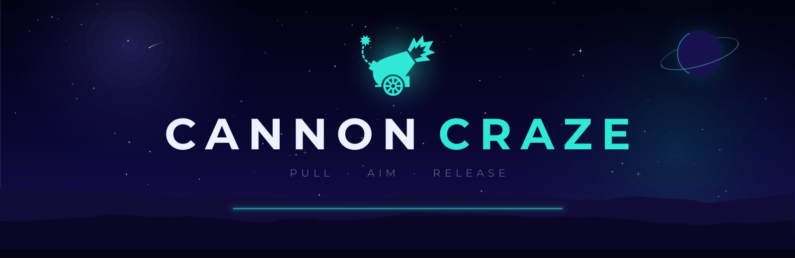

# Cannon Craze

**A minimal, neon-noir arcade cannon game. Pull the glowing cannonball back like a slingshot, release to fire, and land on the lit pad. One miss ends the run.**

[](https://processing.org)
[](https://adoptium.net)
[](LICENSE)
[](#download-and-install)

[Download](#download-and-install) · [How to play](#how-to-play) · [Screenshots](#screenshots) · [Android](#android) · [Run from source](#run-from-source) · [Design system](#design-system)

</div>

---

## Table of contents

1. [Overview](#overview)
2. [Screenshots](#screenshots)
3. [How to play](#how-to-play)
4. [Scoring and difficulty](#scoring-and-difficulty)
5. [Sound](#sound)
6. [Settings](#settings)
7. [Download and install](#download-and-install)
8. [Android](#android)
9. [Run from source](#run-from-source)
10. [Export your own builds](#export-your-own-builds)
11. [Architecture](#architecture)
12. [Design system](#design-system)
13. [Persistence](#persistence)
14. [Project structure](#project-structure)
15. [Contributing](#contributing)
16. [License](#license)
17. [Credits](#credits)

## Overview

Cannon Craze is a one-more-try arcade game built with [Processing](https://processing.org) (Java mode), with a native [Android edition](#android) built on Processing for Android. The window opens at 960 x 600 and can be resized or maximized freely: the scene scales uniformly and the world itself extends past the design region (more sky, wider mountains, longer ground), so the game fills every pixel of any window or screen with no black bars, and plays identically at every size.

Everything is drawn and heard procedurally: the gradient night sky, the twinkling starfield, the ringed planet, the drifting meteors, the noise-based mountain silhouettes, the neon-rimmed launch platform, and every sound effect, synthesized as raw PCM at startup. There are no bitmap art assets and no audio files at all, only code, two font families, and one SVG glyph, which is exactly why the visuals stay razor sharp no matter how large you make the window.

The loop is simple and merciless:

1. Grab the glowing cannonball resting at the muzzle.
2. Drag it back like a slingshot. Distance sets power, direction sets angle.
3. Release. The ball arcs across the night sky.
4. Land on the single lit pad in the row below to score and keep going.
5. Miss once, in any way, and the run is over.

A persistent best score is always waiting to be beaten, and the game saves it the instant you set a new record.

## Screenshots

Every shot below is captured directly from the game.

### Main menu

The title screen: cannon crest with a soft halo, tracked wordmark, and five pill buttons over the living night scene. Stars twinkle, meteors streak by, and the footer keeps your best score in view.

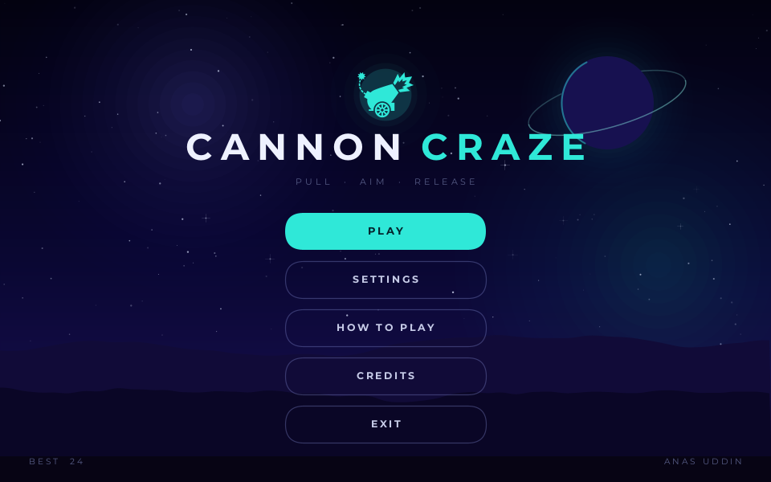

### In the arena

The play field. Score on the left, best on the right, the neon platform on the left edge, and the row of target pads along the bottom. The lit pad pulses and casts a rising column of light so you always know where to land. The idle cannonball breathes with a pulsing ring to invite the grab.

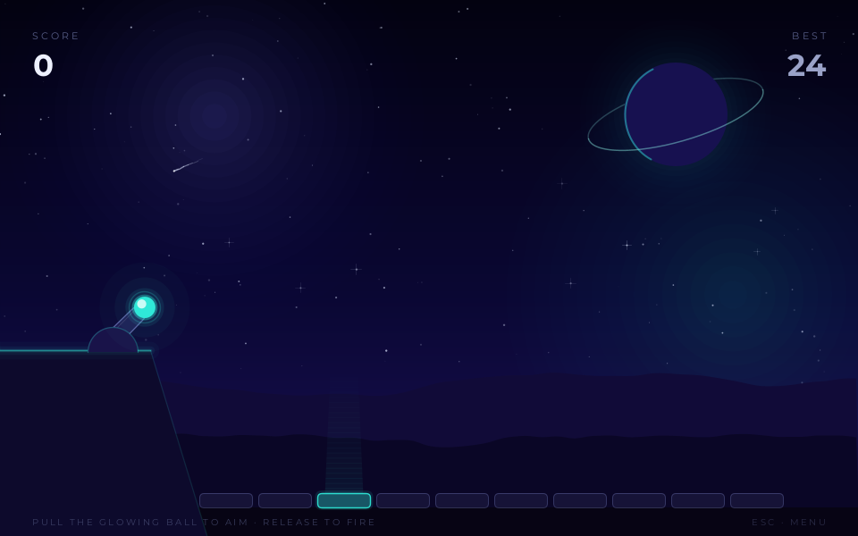

### Aiming

Pull the ball down and left of the cannon to load the shot. You get a taut elastic line, a ghost ball at your fingertip, a dotted trajectory preview that fades with distance, and a live readout of angle and power in the corner. The barrel tracks your pull in real time.

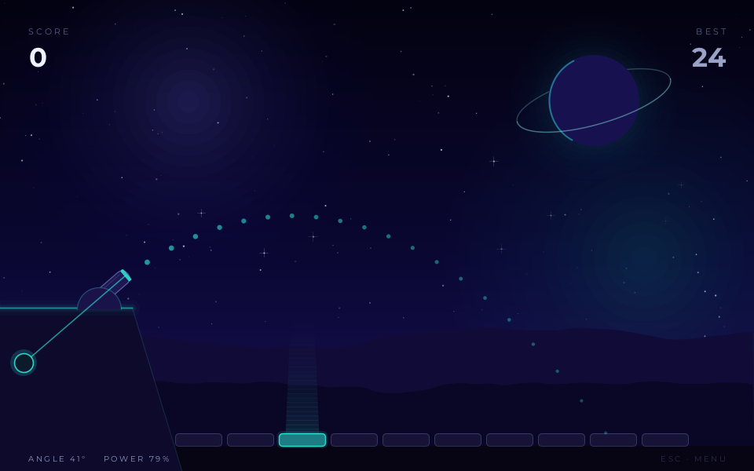

### In flight

Release and the ball sails on a clean parabola, trailing a comet tail of fading cyan, to the sound of a deep launch thump. The readout dims but stays visible so you can study the shot you just committed to.

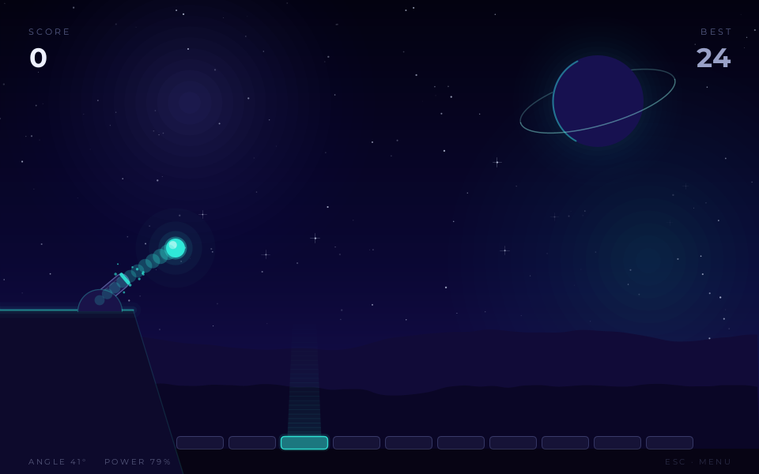

### Game over

Land anywhere but the lit pad and the run ends with a screen shake, a coral burst, a falling tone, and a glass card that shows the final score against your best.

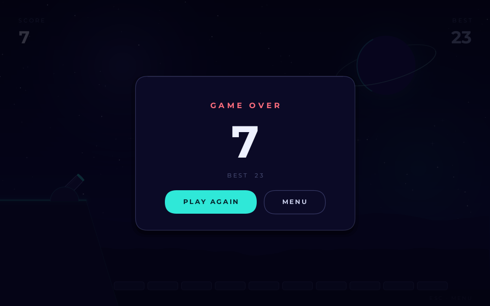

### New record

Beat your best and the card turns gold, confetti erupts in gold and cyan, a little fanfare plays, and the new record is written to disk immediately.

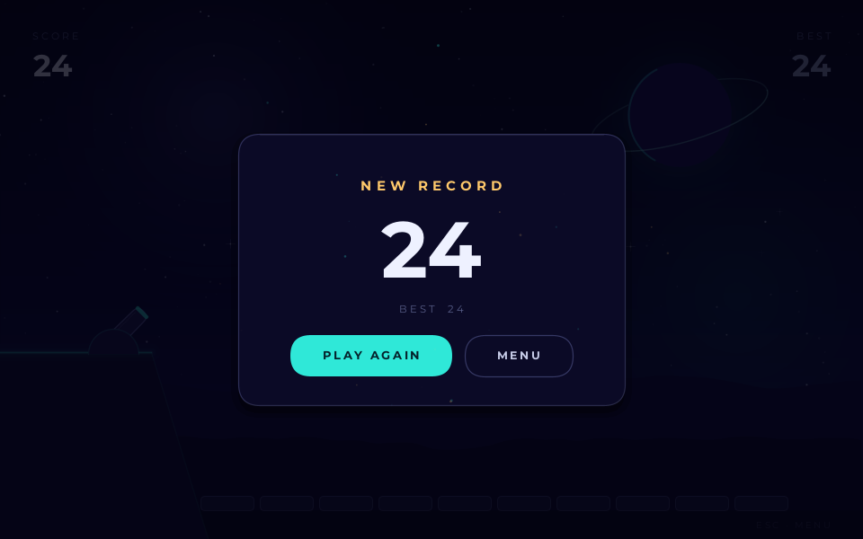

### Settings

Cannonball size, target count, the trajectory guide, sound, and volume, all adjustable from a glass modal. Every change saves automatically the moment you make it.

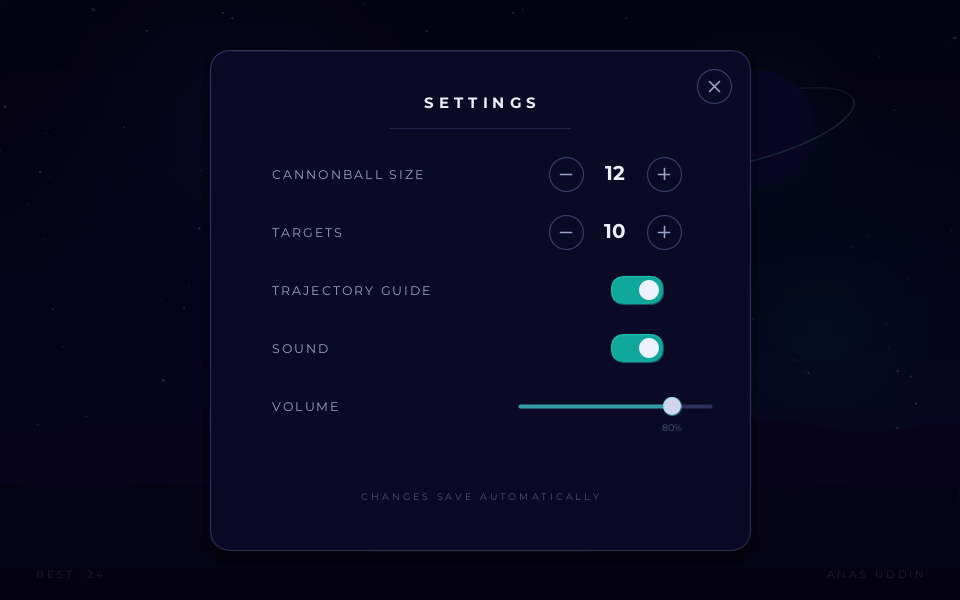

### How to play

A five-step primer lives inside the game too, so nobody has to leave the window to learn the rules.

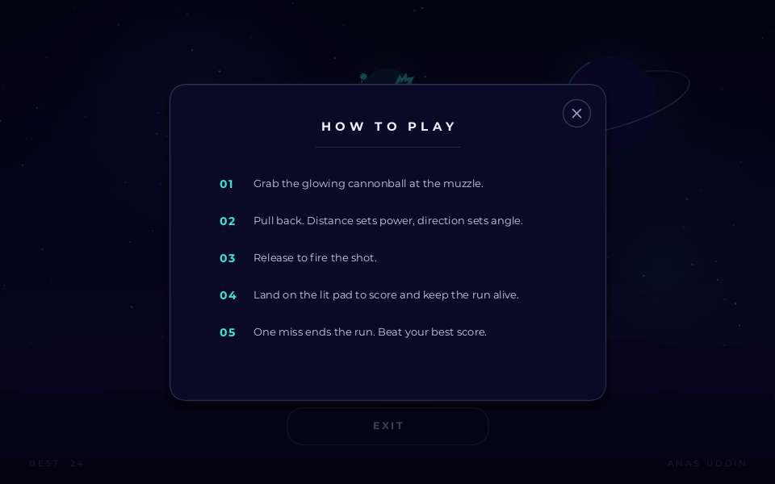

### Credits

A signature card for the author, with a one-click link to GitHub.

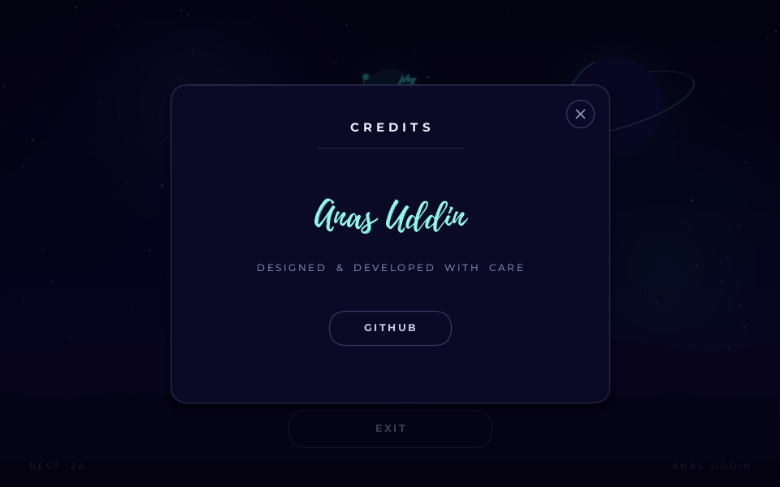

## How to play

| Action | Input |
| --- | --- |
| Aim | Press and hold the left mouse button on the glowing ball, then drag down and to the left |
| Fire | Release the mouse button |
| Cancel a shot | Release after a tiny nudge (a pull of less than a few pixels never fires) |
| Close a modal | Click the X, click outside the card, or press `ESC` |
| Back to menu | Press `ESC` during a run |
| Quit | Press `ESC` on the menu, or use the EXIT button |

On Android everything is one finger: touch and hold the ball, pull, let go. The system back gesture closes modals, then leaves the run, then the game.

The cursor becomes a hand whenever something is grabbable or clickable, so you can feel your way around the UI without reading anything.

The window is yours to shape: drag any edge or hit maximize at any moment, even mid-run. The world stretches to fill every pixel, aiming stays exact because mouse input is mapped back into the game's own coordinate space, and the gameplay geometry never changes.

### The physics

- The pull distance maps directly to launch velocity, up to a maximum draw of 160 pixels. The readout shows this as a power percentage.
- The launch angle is exactly the angle of your pull, mirrored through the pivot. The readout shows it in degrees.
- In flight, the ball follows a pure parabola under constant gravity. What you see in the dotted preview is exactly what you get.
- The trajectory guide can be switched off in Settings for a harder, purer aim.

## Scoring and difficulty

- Each landing on the lit pad scores one point, triggers a white pad flash, a cyan particle burst, a shockwave ring, a floating +1, and a chime that rings one note brighter with every hit in the run.
- After every hit, a new pad lights up. It is never the same pad twice in a row.
- There are three ways to die, and all of them end the run instantly:
  1. Landing on any unlit pad.
  2. Overshooting or undershooting the pad row and falling off the bottom of the screen.
  3. Lobbing the ball so weakly that it drops back onto your own platform.
- Fewer targets means wider pads and a gentler game. More targets means narrower pads and less room for error. Turning off the trajectory guide raises the skill ceiling further.
- Your best score persists between sessions and is displayed on the menu, in the HUD, and on the game over card.

## Sound

Every sound in the game is synthesized from pure math when the game starts, in the same spirit as the fully procedural visuals. There are no audio files.

| Sound | Design |
| --- | --- |
| Launch | A deep thump: a fast downward sine sweep with a burst of low-passed noise for the muzzle blast, through a soft clipper |
| Hit chime | A bright three-partial bell. Each hit in a run rings one step higher on a pentatonic ladder, so a long streak literally rises |
| Game over | A falling tone with a dull thud, sad but quick, so retries stay snappy |
| New record | A four-note rising fanfare of the same bell voice |
| UI | Soft clicks for buttons, a lower blip for toggles, a tiny tick while sliding the volume so you hear the level you are setting |
| Grab | A quiet rising pluck when you pick up the ball |

Playback runs on a small pool of pre-opened audio lines (desktop) or a custom AudioTrack software mixer (Android), so effects overlap freely with near-zero latency. Sound can be switched off entirely, and the volume slider saves automatically like every other setting. On a machine with no audio device the game simply plays silent.

## Settings

All five options live in the in-game Settings modal and save to disk automatically on every change.

| Setting | Range | Default | Effect |
| --- | --- | --- | --- |
| Cannonball size | 5 to 15 | 12 | Radius of the ball in pixels. Bigger is easier to land, smaller is harder to grab and land |
| Targets | 5 to 15 | 10 | Number of pads in the row. More pads means narrower pads |
| Trajectory guide | On / Off | On | Shows or hides the dotted flight preview while aiming |
| Sound | On / Off | On | Master switch for all sound effects |
| Volume | 0 to 100% | 80% | Master volume, on a draggable slider with live audio feedback |

## Download and install

Prebuilt packages for every desktop platform are published on the [Releases page](https://github.com/theanasuddin/CannonCraze/releases). The Windows package bundles its own Java runtime, so it is fully self-contained. The macOS and Linux packages are small and expect Java 17 or newer on the machine (free from [Adoptium](https://adoptium.net), one minute to install).

| Platform | Package | Java needed? |
| --- | --- | --- |
| Windows 10 / 11 (x64) | [CannonCraze-windows-x64.zip](https://github.com/theanasuddin/CannonCraze/releases/latest/download/CannonCraze-windows-x64.zip) | No, bundled |
| macOS (Apple Silicon) | [CannonCraze-macos-apple-silicon.zip](https://github.com/theanasuddin/CannonCraze/releases/latest/download/CannonCraze-macos-apple-silicon.zip) | Yes, 17+ |
| macOS (Intel) | [CannonCraze-macos-intel.zip](https://github.com/theanasuddin/CannonCraze/releases/latest/download/CannonCraze-macos-intel.zip) | Yes, 17+ |
| Linux (x64) | [CannonCraze-linux-x64.zip](https://github.com/theanasuddin/CannonCraze/releases/latest/download/CannonCraze-linux-x64.zip) | Yes, 17+ |
| Linux (ARM 64-bit, Raspberry Pi 4 / 5) | [CannonCraze-linux-arm64.zip](https://github.com/theanasuddin/CannonCraze/releases/latest/download/CannonCraze-linux-arm64.zip) | Yes, 17+ |
| Linux (ARM 32-bit, older Raspberry Pi) | [CannonCraze-linux-arm32.zip](https://github.com/theanasuddin/CannonCraze/releases/latest/download/CannonCraze-linux-arm32.zip) | Yes, 17+ |
| Android 5.0+ | [Android project](android/), Play Store release in progress | n/a |

### Windows

1. Download and extract the zip anywhere you like (a writable location such as your user folder is best, since the game saves your score next to itself).
2. Open the `CannonCraze` folder and double-click `CannonCraze.exe`.
3. If SmartScreen appears (the build is not code-signed), click **More info**, then **Run anyway**.

Nothing else to install: the zip carries its own Java runtime, and the executable is stamped with the game's icon and version info.

### macOS

1. Install Java 17 or newer if you do not have it: grab [Temurin 17](https://adoptium.net/temurin/releases/?os=mac) or run `brew install --cask temurin`.
2. Download the zip for your chip (Apple menu, About This Mac, check Chip / Processor).
3. Extract and move `CannonCraze.app` wherever you like.
4. First launch: right-click the app, choose **Open**, then confirm. This is the standard path for apps that are not notarized.
5. If macOS still refuses, clear the quarantine flag and make sure the launcher is executable, then open it again:

   ```bash
   xattr -cr CannonCraze.app
   chmod +x CannonCraze.app/Contents/MacOS/CannonCraze
   ```

### Linux

Install Java 17 or newer first (`sudo apt install openjdk-17-jre` on Debian and Ubuntu flavors, or use [Adoptium](https://adoptium.net)). Then:

```bash
unzip CannonCraze-linux-x64.zip
cd CannonCraze
chmod +x CannonCraze
./CannonCraze
```

The same steps apply to both ARM packages, just with the matching file name.

## Android

The [`android/`](android/) folder is a complete, production-ready Android Studio project: the same game, ported for touch, fullscreen landscape, GPU rendering, and zero permissions. See [`android/README.md`](android/README.md) for building and running it.

Highlights of the port:

- Identical gameplay, physics, palette, and procedural sound
- P2D (OpenGL ES) rendering, fullscreen immersive, notch to notch
- Single-touch aiming with a finger-sized grab zone
- The system back gesture walks modal, then run, then menu
- Saves via SharedPreferences, no permissions, no network, no ads
- Adaptive launcher icons (with Android 13 themed-icon support) generated from the same vector glyph as everything else

## Run from source

The sketch runs anywhere Processing 4 runs.

### Processing IDE

1. Install [Processing 4](https://processing.org/download).
2. Clone or download this repository.
3. Open `CannonCraze.pde` in the IDE and press **Run**.

```bash
git clone https://github.com/theanasuddin/CannonCraze.git
```

### Visual Studio Code

The repo ships a build task in `.vscode/tasks.json`. Point the `processing.path` setting at your Processing executable, then run the default build task (**Run Sketch**). The task invokes the Processing CLI with `--sketch` and `--run`.

### Processing command line

Processing 4.5+ has a first-class CLI. With the `processing` launcher on your PATH:

```bash
processing cli --force --sketch="/path/to/CannonCraze" --output="/path/to/CannonCraze/out" --run
```

## Export your own builds

The packages on the Releases page were produced with the Processing CLI export, one run per platform variant:

```bash
processing cli --force --sketch="/path/to/CannonCraze" \
  --output="/path/to/out-windows" --variant=windows-amd64 --export
```

Available variants: `windows-amd64`, `macos-x86_64`, `macos-aarch64`, `linux-amd64`, `linux-arm`, `linux-aarch64`. Each export contains the launcher, the compiled sketch and libraries in `lib/`, the `data/` folder, and a `source/` copy of the sketch, ready to zip and share.

Two practical notes from building the official packages:

- Processing can only embed a Java runtime for the platform it is running on, so the Windows package was exported on Windows with Java bundled, and the macOS and Linux packages were exported with the additional `--no-java` flag.
- The Windows executable is stamped with the multi-resolution `docs/icon/CannonCraze.ico`, and the macOS bundles carry `docs/icon/CannonCraze.icns`. Both are built from the same procedural art the game renders for its own window icon.

For the Android build, see [`android/README.md`](android/README.md).

## Architecture

The desktop code is organized as one tab per concern. All tabs compile into a single sketch class, so the split is purely for readability.

| Tab | Responsibility |
| --- | --- |
| `CannonCraze.pde` | Entry point. Screen and modal state machine, gameplay constants, global game state, input routing, round and game-over flow |
| `Theme.pde` | The design system: full color palette, font loading, the cannon glyph, easing, letter-spaced text helpers, glow primitives, glass panels |
| `Viewport.pde` | The resizable-window system: a fixed 960 x 600 design canvas scaled uniformly, with the world extended past it so every pixel of the window is scene, never bars, plus the window-to-canvas mouse mapping |
| `Background.pde` | The night scene. Static layers (sky gradient, nebula glows, ringed planet, mountain ridges, ground) render once into a window-sized buffer; stars twinkle and meteors streak on top every frame |
| `Gameplay.pde` | The cannon, aiming and the elastic pull, the trajectory preview, projectile integration, target pads and hit resolution, HUD, readouts, and the game-over overlay |
| `Menu.pde` | Main menu: logo crest, wordmark, buttons, footer, widget construction |
| `Ui.pde` | Reusable widgets (pill buttons, round icon buttons, animated toggle, draggable slider) and the three modal windows: Settings, How to play, Credits |
| `Particles.pde` | A single lightweight particle system for sparks, comet trails, shockwave rings, floating score text, and record confetti |
| `Sound.pde` | The procedural sound designer: synthesizes every effect as raw PCM at startup and feeds a small pool of audio voices |
| `SoundVoice.java` | One pre-opened audio output line on a daemon thread (a plain Java tab, since the sketch preprocessor cannot parse `line.open`) |
| `CannonCrazeGraphics.java` | The stock Java2D renderer plus a one-line fix that stops a JDK buffer race from freezing the sketch during live window resizes |
| `Persistence.pde` | Loading and saving the high score and settings as tiny plain-text files |

The Android port (`android/app/src/main/java/`) mirrors the same sections inside one `Sketch.java`, with `SoundEngine.java` as the mixer and `MainActivity.java` as the fragment host.

A few implementation notes worth knowing:

- **One draw loop, no surprises.** `draw()` dispatches to the current screen, then layers the active modal, then a fade-in veil after screen switches. Input handlers are tiny routers that delegate to whichever surface is on top.
- **Resolution independence, extended.** The game simulates and lays out on a fixed 960 x 600 design canvas. Each frame the viewport computes one uniform scale, then extends the world beyond the design region to cover the whole window: the sky reaches higher, the mountains and ground run wider, the platform pours out to the true edges. Gameplay geometry never moves, so physics and difficulty are untouched by window size, and there are no letterbox bars, ever.
- **The scene is cached and blitted 1:1.** Everything static about the background renders into a buffer sized to the window's exact pixels, rebuilt only on resize. Each frame it blits in screen space with no transform, which keeps Java2D on its fast copy path; drawing it under the fractional viewport scale instead would force per-pixel interpolation (measured: 12 fps versus 60 fps at 1920 x 1080).
- **Resize is crash-proof.** Live-resizing an AWT window can race the JDK's buffer strategy and used to kill the animation thread with a NullPointerException. The custom surface in `CannonCrazeGraphics.java` drops that single stale frame instead, and the game never notices.
- **The sound is a synthesizer, not a sample bank.** Sine partials, noise bursts, one-pole filters, exponential envelopes, and a soft clipper, rendered once at startup into PCM buffers. The hit chime is pitch-laddered by streak; volume applies at play time on a perceptual (squared) curve.
- **Animation is stateless easing.** UI motion uses `lerp` toward targets and an `easeOutCubic` curve, so every entrance, hover, recoil, pop, and shake settles smoothly without timeline bookkeeping.
- **The whole game is cursor-aware.** Any hoverable control raises a flag during drawing, and the frame ends by picking the hand or arrow cursor. UI affordance comes for free everywhere.
- **Deterministic flight.** The projectile is integrated from the same closed-form parabola the preview samples, so the guide never lies.

## Design system

The look is a deep-navy night with a single luminous accent, applied consistently across the scene, the UI, and the branding.

### Palette

| Swatch | Name | Hex | Used for |
| --- | --- | --- | --- |
|  | Ink | `#EEF1FF` | Primary text, score |
|  | Ink dim | `#9AA2C8` | Secondary text, best score |
|  | Ink faint | `#565C86` | Hints, footers, labels |
|  | Accent | `#2FE8D8` | The cannonball, lit pad, buttons, glows, brand |
|  | Accent soft | `#8FF7EC` | Hover states, highlights, signature text |
|  | Accent deep | `#0FA89B` | Toggle fill, nebula glow |
|  | Violet | `#7B6CFF` | Nebula glow |
|  | Coral | `#FF6E7E` | Game over, close buttons, miss bursts |
|  | Gold | `#FFC96B` | New record, confetti |
|  | Sky top | `#030210` | Zenith of the gradient, fades and dims |
|  | Sky mid | `#0A0733` | Middle of the gradient |
|  | Sky horizon | `#1A1156` | Horizon of the gradient |
|  | Panel | `#0B0A26` | Glass cards and modals |
|  | Panel line | `#7E86CD` | Card borders, idle pad outlines, widget strokes |

### Typography

- **Montserrat** (Regular and Bold) carries the entire UI, always uppercase with generous letter tracking for labels and buttons. Tracking is implemented by a custom per-character layout helper.
- **Playlist Script** appears exactly once, as the author signature on the Credits card, which makes that single moment feel personal.

### Light and effects

- **Layered glow.** Neon is faked the honest way: several concentric passes at increasing size and decreasing alpha under a bright core. The same primitive lights the ball, the platform rim, and the brand crest.
- **Glass panels.** Cards stack two soft shadow passes, a near-opaque navy fill, a cool border, and a one-pixel top highlight.
- **The living sky.** Stars twinkle on individual phases (the field grows with the window so wide screens get more of them), one in nineteen gets a cross sparkle, and a meteor streaks by every 6 to 13 seconds.

### Branding

The app icon, the README banner, the Play Store feature graphic, and the Android adaptive icons are all rendered by the game's own drawing code, using the same palette constants, the same glow primitives, and the same SVG cannon glyph as the main menu. The icon ships at every size from 1024 down to 16 in `docs/icon/`, plus a multi-resolution `CannonCraze.ico` that is embedded in the Windows executable.

<div align="center">

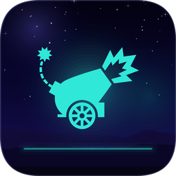

</div>

## Persistence

On desktop, state lives in two tiny plain-text files inside `data/`, created and updated automatically:

| File | Content | When it is written |
| --- | --- | --- |
| `data/high_score.txt` | A single integer, your best score | The moment a run ends with a new record |
| `data/settings.txt` | Five lines: target count, guide hidden flag, ball radius, sound on flag, volume | On every change in the Settings modal and when the modal closes |

Both loaders are defensive: missing, malformed, or older three-line files simply fall back to defaults, so deleting either file is a clean reset. The Android edition stores the same values in SharedPreferences.

## Project structure

```
CannonCraze/
|-- CannonCraze.pde           # Entry point: state, constants, flow, input
|-- Theme.pde                 # Design system: palette, fonts, glow, panels
|-- Viewport.pde              # Full-bleed scaling over the design canvas
|-- Background.pde            # Procedural night scene with cached buffer
|-- Gameplay.pde              # Cannon, aiming, flight, targets, HUD, overlay
|-- Menu.pde                  # Main menu
|-- Ui.pde                    # Widgets and modals
|-- Particles.pde             # Particle system
|-- Sound.pde                 # Procedural sound synthesis
|-- SoundVoice.java           # Audio output voice (pure Java tab)
|-- CannonCrazeGraphics.java  # Java2D renderer with the resize fix
|-- Persistence.pde           # High score + settings on disk
|-- data/
|   |-- Montserrat-Regular.otf
|   |-- Montserrat-Bold.otf
|   |-- Playlist-Script.otf
|   |-- logo.svg              # The cannon glyph (menu crest, icons, banner)
|   |-- icon.png              # Window / taskbar icon (procedurally rendered)
|   |-- high_score.txt        # Created at runtime, not tracked in git
|   `-- settings.txt          # Created at runtime, not tracked in git
|-- android/                  # Complete Android Studio project (see its README)
|-- docs/
|   |-- banner.png            # README banner, rendered by the game's code
|   |-- icon/                 # Icon set: 16 to 1024 px, plus .ico and .icns
|   |-- screenshots/          # Everything you saw above
|   `-- PRIVACY_POLICY.md     # Privacy policy (nothing is collected)
|-- .github/                  # Issue forms and the PR template
|-- .vscode/tasks.json        # Run Sketch task for VS Code
|-- CONTRIBUTING.md
|-- CODE_OF_CONDUCT.md
|-- SECURITY.md
`-- LICENSE                   # GPL-2.0
```

## Contributing

Bug reports, feature ideas, and pull requests are welcome. Start with [CONTRIBUTING.md](CONTRIBUTING.md); the short version is: keep everything procedural, keep the two platforms in step, and play a full run before you push.

## License

This project is licensed under the GNU General Public License v2.0. See [LICENSE](LICENSE) for the full text.

## Credits

- **Design and development:** [Anas Uddin](https://github.com/theanasuddin)
- **Engine:** [Processing 4](https://processing.org) and [Processing for Android](https://android.processing.org) by the Processing Foundation
- **Typefaces:** Montserrat by Julieta Ulanovsky and contributors (SIL Open Font License), Playlist Script by Artimasa
- **Everything else on screen and in your ears:** procedural code in this repository

<div align="center">

**PULL · AIM · RELEASE**

If the game made you retry "just one more time", a star on the repo is the nicest way to say so.

</div>
